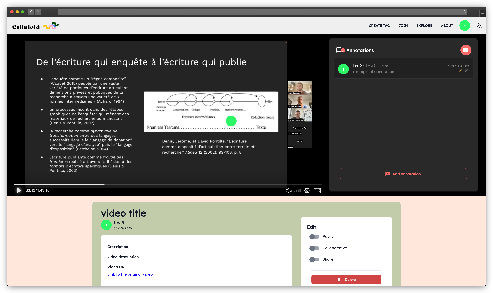

# Celluloid

[](https://opensource.org/licenses/MIT)
[](https://github.com/celluloid-camp/celluloid/actions/workflows/build.yml)
[](https://celluloid-camp.github.io/celluloid)

## Overview



Celluloid is a collaborative video annotation application designed for educational purposes.

With Celluloid, you can find a [PeerTube](https://joinpeertube.org/) video, select an educational objective, annotate the video, share it with your students, collect their answers, and respond to their questions.

## ✨ Demo

Visit https://celluloid.huma-num.fr/, create an account, and start using Celluloid.
We value your feedback on the application's user experience and design. If you encounter any bugs or issues, please don't hesitate to [report them](https://github.com/celluloid-camp/celluloid/issues).

## Development Team

Celluloid originated from a research project led by **Michaël Bourgatte** and **Laurent Tessier**, two senior lecturers at the [Catholic University of Paris](https://en.icp.fr/english-version/). Their work focuses on educational science and digital humanities.
Celluloid is currently maintained by [Younes Benaomar](https://github.com/younes200), and we actively encourage contributions and involvement from the community. Feel free to reach out to us on [Discussions](https://github.com/celluloid-camp/celluloid/discussions).

# Setup

## Prerequisites

### Environment

Celluloid is designed to run on a Linux server. Proficiency with the command-line interface is necessary for deployment and installation. It's highly recommended to use an OSX or Linux workstation.

### 🔨 Tools

- Install the latest version of [Git](https://git-scm.com/).
- Install the latest version of [Node.js](https://nodejs.org/en/).
- Install the latest version of [Yarn](https://yarnpkg.com/en/) and use it instead of NPM. 

The project is organized as a [monorepo](https://blog.scottlogic.com/2018/02/23/javascript-monorepos.html), so Yarn is required to leverage [Yarn workspace](https://yarnpkg.com/blog/2017/08/02/introducing-workspaces/).

```
.
├── apps/                # Main application containers
│   ├── frontend/        # Frontend application code
│   ├── backend/         # Backend application code
│   └── admin/           # Admin panel code
├── packages/            # Shared packages
│   ├── config/          # Configuration settings and files
│   ├── i18n/            # Internationalization settings and translations
│   ├── passport/        # Passport authentication settings
│   ├── prisma/          # Prisma ORM configurations and schema
│   ├── trpc/            # tRPC settings and utilities
│   ├── types/           # Shared TypeScript types
│   └── utils/           # Shared utilities
├── tests/               # Test scripts and test-related utilities
├── scripts/             # Miscellaneous scripts for automation
├── packages.json        # Package manifest
└── .env                 # Environment variables
```


### 📦 Database

You will need a working [PostgreSQL server](https://www.postgresql.org/docs/current/static/tutorial-install.html), version 13 or later.

We provide a complete docker compose [stack.yml](stack.yml) ready to run :

```bash
docker compose -f stack.yml up
```

### Emails

A functioning SMTP server is necessary for sending account confirmation emails.
we've configured Nodemailer to use [ethereal.email](https://ethereal.email) to catch all development emails, and regular SMTP in production (easy to replace with a different provider thanks to Nodemailer)

## Installation from Source

### Initial steps

Open your terminal and execute the following commands:

```bash
git clone https://github.com/celluloid-camp/celluloid.git
cd celluloid/
yarn
```

### Configuration

Copy the sample environment file:

```bash
cp sample.env .env
```

Open the newly created .env file with your preferred text editor and configure the values according to your requirements.

### Development Mode

For development purposes, you can use the provided Docker Compose [docker-compose.yml](docker-compose.yml) and run the command:

At the root of your repository, run the projet in development mode:

```bash
yarn dev
```

This will initiate an interactive build and open the app in a browser window while continuously monitoring source files for modifications.
If everything worked without errors, you should be all set. Otherwise, please review the instructions above carefully.

### Production Mode

Build and start the application:

```bash
yarn build
yarn backend start
yarn frontend start
```

You can access your app at http://localhost:3000.

### Building and starting the application as a docker Container

Open a terminal at the repository's root and run:

```bash
docker build --build-arg APP=backend -t  celluloid-backend:latest  .
docker build --build-arg APP=frontend -t  celluloid-frontend:latest  .
```

(Ensure that [Docker](https://www.docker.com/get-started) is correctly installed.)

### Contributing

**\*We actively welcome motivated contributors!**

Feel free to open a pull request, [contact us](https://github.com/celluloid-camp/celluloid/discussions), or [report a bug](https://github.com/celluloid-camp/celluloid/issues).

## Technical Stack

Before contributing to Celluloid's development, it's essential to familiarize yourself with some of the following technologies:

- TypeScript (used throughout the project).
- Frontend: React, TRPC, and Material UI.
- Backend: Node.js, Express, and Prisma.
- Database: PostgreSQL.

## V1 Legacy

You can still find the old Celluloid version 1 that supports YouTube videos [here](https://github.com/celluloid-camp/celluloid/releases/tag/v1).


